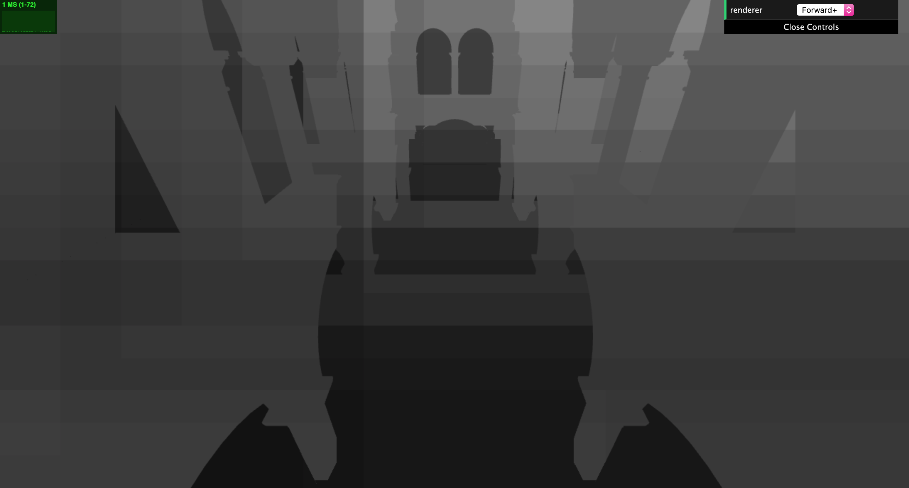
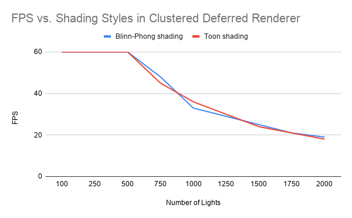
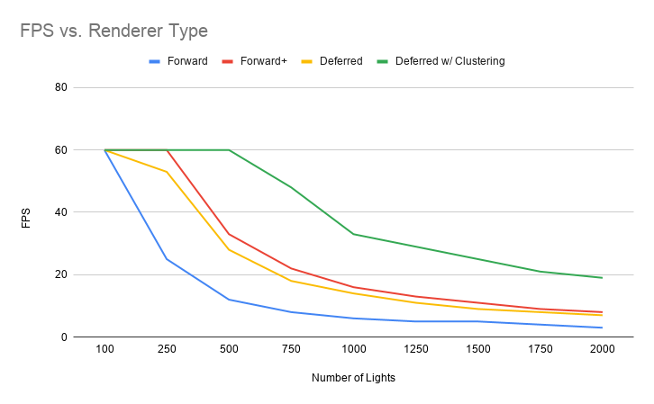
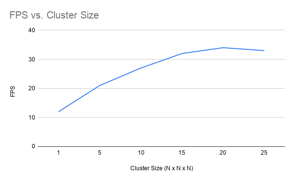
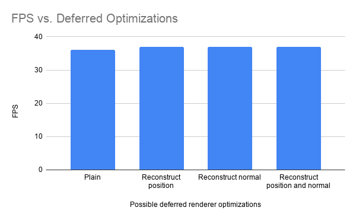

# WebGL Clustered Deferred and Forward+ Shading
**University of Pennsylvania, CIS 565: GPU Programming and Architecture,
Project 6**

Caroline Lachanski: [LinkedIn](https://www.linkedin.com/in/caroline-lachanski/), [personal website](http://carolinelachanski.com/)

Tested on: Google Chrome 78.0.3904.70, Windows 10, i5-6500 @ 3.20GHz 16GB, GTX 1660 (personal computer)

[**Live demo here**](http://carolinelachanski.com/Project6-WebGL-Clustered-Deferred-Forward-Plus/)

## Project Overview

The goal of this project was to create forward+ and clustered deferred renderers using WebGL. 

### Forward+

Forward+ rendering consists of two steps: 

1. Light culling
2. Forward rendering

In our forward+ renderer, we perform light culling in camera space. This bins all of the lights in the scene within specific clusters (grid locations within a grid encompassing the view frustum). Then forward rendering proceeds as normal, except when it comes to accumulating the lights' contributions to shading a fragment. Rather than looping over all of the lights in the fragment shader, we simply determine in which cluster our fragment lies, then shade using only the lights contributing to that cluster.

Here's a visualization of the clusters (here, a 15x15x15 grid) in the Sponza scene. The brighter a cluster, the more lights effecting that cluster.

Forward+ rendering is good at handling scenes with many, many lights. And because of its general similarity to forward rendering, it can easily handle both opaque and transparent geometry (unlike deferred rendering). 

### Clustered Deferred

Generally, fragment shading is the most computationally expensive part of the rendering pipeline. The goal of deferred rendering is to postpone (defer) fragment shading until the last possible moment, and avoid unnecessary computations. All the necessary information for shading such as position, normals, albedo, etc. are written to G buffers (essentially textures). Then, a screen space quad is rendered using information from the G buffers. With deferred rendering, only pixels that will be in the final image are shaded, saving a lot of computation time.

We can add the same light clustering functionality used in forward+ to a deferred render to make it even more efficient. 

### Deferred Optimizations

There are lots of strategies to optimize the use of G buffers within deferred rendering. For example, instead of passing world space position in a G buffer, we can reconstruct in the final fragment shader using the screen space position and the inverse view-projection matrix. Similarly, rather than passing three components per normal, we can pass two and reconstruct the third later. Efficient packing of these values in the G buffer can also help.

### Toon Shading in Deferred

In addition to Blinn-Phong shading, I also attempted a toon shading style (a combination of ramp shading and edge detection). Ramping shading is accomplished by essentially binning the color values. I used both the depth texture and the normal texture as input to a Sobel filter to find edges in my scene (this post-processing effect was only made possible since my deferred render has these textures).

The results are... okay:

I was disappointed with the results of the edge detection, here visualized in red:

You can see that some obvious edges in the architecture are not detected (although the edges between bricks were very easily detected due to the normal map). I tried making my depth values more contrasting by decreasing my far plane distance, but that only helped so much. Perhaps there is a way to make edge detection more sensitive.

In terms of performance, toon shading didn't seem any better or worse than Blinn-Phong shading, even though toon shading requires many more calculations in the fragment shader. Perhaps the effective difference is neglibile.

## Performance Analysis

We can compare the performance of each of the renderers and seeing what happens as we increase the number of lights. Unfortunately, Google Chrome caps my browser FPS to 60 FPS.

We can see see a clear performance hierarchy. Clustered deferred performs best, followed by forward+, then regular deferred, then regular forward. Clustered deferred seems particularly robust as the number of lights increases.

We can also see the effect of cluster dimensions on performance:

As expected, a cluster with dimensions 1x1x1 performs no better than forward rendering with no clustering. As we increase the cluster dimensions, we see an increase in performance, with FPS leveling off at about 15 x 15 x 15 clusters. I did try to test cluster dimensions sizes greater than 25, but could not due to WebGL limitations on texture size (the cluster data structure is stored as an (NxNxN, (number of lights in scene + 1) / 4) size 2D texture, but the GPU limits the max value you can use for indexing a texture. Increasing the cluster/texture size to 26x26x26 in the x dimension would surpass that max limit).

In the future, it would be interesting to compare cluster grids with unequal dimensions (for example, a 15x15x5 grid). Due to the large distance between the near and far plane relative to the scale of my scene, I found that the large majority of my lights ended up in the first two z-slices anyway.

Finally, we can also compare the various optimizations performed in the deferred renderer:

There appears to be little to no difference in performance when reconstructing the position and/or normal later during deferred shading instead of passing them completely through the G buffer. This is somewhat unexpected, since using both optimizations results in one less G buffer being needed. Perhaps the extra calculations needed to recompute worldspace position and the normal's z component were enough overhead that any benefit from one less texture call was lost. 

There are definitely more efficient ways to pack the G buffers. Even in the most "optimized" state, only passing three albedo components and two normal components, we still need two G buffers, and those buffers will have empty space leftover. Perhaps if we had a slightly more robust renderer, such as one needing specularity or other material properties, utilization of the G buffer space would be better.

## Credits

* [Three.js](https://github.com/mrdoob/three.js) by [@mrdoob](https://github.com/mrdoob) and contributors
* [stats.js](https://github.com/mrdoob/stats.js) by [@mrdoob](https://github.com/mrdoob) and contributors
* [webgl-debug](https://github.com/KhronosGroup/WebGLDeveloperTools) by Khronos Group Inc.
* [glMatrix](https://github.com/toji/gl-matrix) by [@toji](https://github.com/toji) and contributors
* [minimal-gltf-loader](https://github.com/shrekshao/minimal-gltf-loader) by [@shrekshao](https://github.com/shrekshao)
